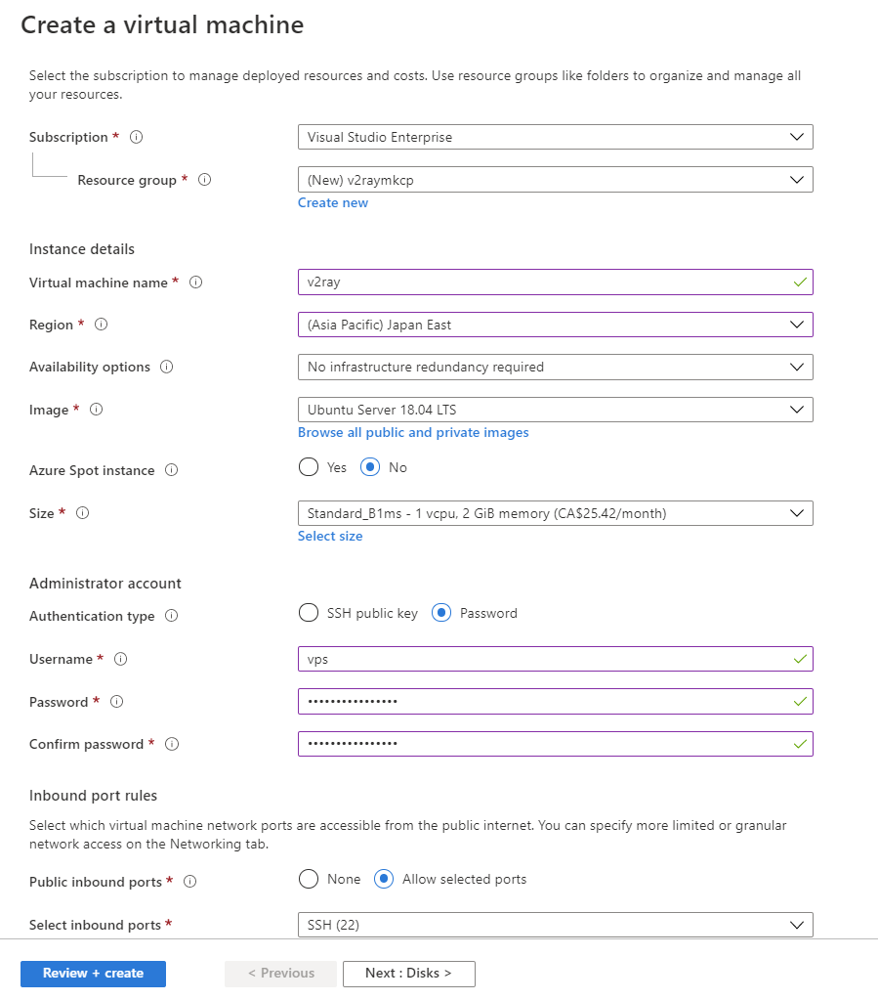

# Vless + TLS + XTLS-rprx-direct

## Requirements
- VM
- 域名（已绑定vm）
    - 注意：如果使用cloudflare，需要关闭Proxy。
    - 开启Always use https。

## Create VMs



- Enable `443` inbound ports
- Stop auto-shutdown config.  

## Login in root user.
```
sudo -i
apt update
apt install -y openssl socat curl unzip vim
```

## Enable TLS
```
curl https://get.acme.sh | sh

source ~/.bashrc

# Register account first
.acme.sh/acme.sh --register-account -m my@example.com

# must enable 80/443 inbound ports
.acme.sh/acme.sh --issue -d 域名 --standalone -k ec-256

.acme.sh/acme.sh --installcert -d 域名 --fullchainpath /etc/ssl/private/<域名>.crt --keypath /etc/ssl/private/<域名>.key --ecc

chmod 755 -R /etc/ssl/private

acme.sh --upgrade --auto-upgrade
```

## Enable ngnix
```
apt install nginx -y

mkdir -p /var/www/website/html

# download template web(template.zip) from https://templated.co/
unzip -o -d /var/www/website/html template.zip

vim /etc/nginx/conf.d/myweb.conf

# Add content below in http {}
----------------------------------------------------
server {
    listen 80;
    server_name 域名;
    root /var/www/website/html;
    index index.html;
    # return 301 https://$http_host$request_uri; // 无需配置跳转，cloudflare已经配置always https
}
server {
    listen 127.0.0.1:8080;
    root /var/www/website/html;
    index index.html;
    add_header Strict-Transport-Security "max-age=63072000" always;
}
----------------------------------------------------
```

## Install xray
```
bash -c "$(curl -L https://github.com/XTLS/Xray-install/raw/main/install-release.sh)" @ install

vim /usr/local/etc/xray/config.json

# Add content below
----------------------------------------------------
{
    "log": {
        "loglevel": "warning",
        "access": "/var/log/xray/access.log",
        "error": "/var/log/xray/error.log"
    },
    "routing": {
        "domainStrategy": "IPIfNonMatch",
        "rules": [
            {
                "type": "field",
                "ip": ["geoip:cn"],
                "outboundTag": "block"
            }
        ]
    },
    "inbounds": [
        {
            "port": 443,
            "protocol": "vless",
            "settings": {
                "clients": [
                    {
                        "id": "<生成的GUID>", # cat /proc/sys/kernel/random/uuid
                        "flow": "xtls-rprx-vision"
                    }
                ],
                "decryption": "none",
                "fallbacks": [
                    {
                        "dest": 8080
                    }
                ]
            },
            "streamSettings": {
                "network": "tcp",
                "security": "tls",
                "tlsSettings": {
                    "rejectUnknownSni": true,
                    "fingerprint": "chrome",
                    "allowInsecure": false,
                    "alpn": ["http/1.1", "h2"],
                    "minVersion": "1.2",
                    "certificates": [
                        {
                            "ocspStapling": 3600,
                            "certificateFile": "/etc/ssl/private/<域名>.crt", // 换成你的证书，绝对路径
                            "keyFile": "/etc/ssl/private/<域名>.key" // 换成你的私钥，绝对路径
                        }
                    ]
                }
            },
            "sniffing": {
                "enabled": true,
                "destOverride": ["http", "tls"]
            }
        }
    ],
    "outbounds": [
        {
            "protocol": "freedom",
            "tag": "direct"
        },
        {
            "protocol": "blackhole",
            "tag": "block"
        }
    ],
    "policy": {
        "levels": {
            "0": {
                "handshake": 2,
                "connIdle": 120
            }
        }
    }
}

----------------------------------------------------

```

## Restart Service
```
systemctl start xray
systemctl status xray
systemctl restart xray

systemctl reload nginx

systemctl enable xray
systemctl enable nginx
```

## Monthly renew cert.
```
vim /etc/ssl/private/xray-cert-renew.sh

# Add content below.
---------------------------------------------
#!/bin/bash
.acme.sh/acme.sh --install-cert -d a-<域名> --ecc --fullchain-file /etc/ssl/private/<域名>.crt --key-file /etc/ssl/private/<域名>.key
echo "Xray Cert Renewed"

chmod +r /etc/ssl/private/<域名>.key
echo "Add Read Permission for private key"

sudo systemctl restart xray
echo "Restarted xray"
---------------------------------------------

chmod +x /etc/ssl/private/xray-cert-renew.sh

crontab -e
0 1 1 * * bash /etc/ssl/private/xray-cert-renew.sh
```


